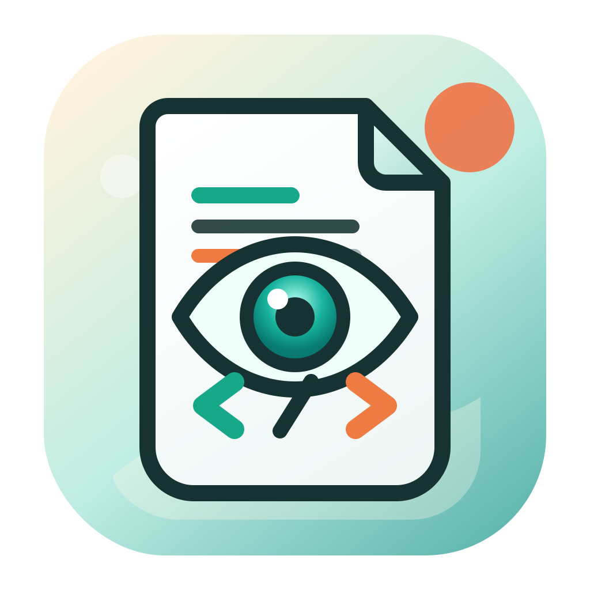

<p align="center">
  
</p>

<h1 align="center">Peeky</h1>

<p align="center">
  A small native macOS viewer for developer-facing text files.
</p>

<p align="center">
  <a href="https://github.com/zhangzhejian/Peeky/actions/workflows/build-app.yml">
    
  </a>
  
  
</p>

Peeky is a read-only preview app for quickly inspecting Markdown, JSON, JSONL,
XML, property lists, source code, logs, CSV/TSV, YAML, and plain text files.

It is intentionally small: AppKit, `NSTextView`, no WebView, no editor surface,
and no telemetry. Open a file, inspect it, copy what you need, and move on.

## Features

- Native macOS interface with tabs, drag-and-drop opening, and Finder integration.
- Markdown preview with headings, lists, block quotes, links, inline code, tables,
  and a clickable heading outline.
- JSON, JSONL/NDJSON, XML, and plist formatting with lightweight syntax
  highlighting.
- Source code highlighting for common programming languages without modifying
  the original file contents.
- Raw/format toggle, line wrap toggle, copy preview, reveal in Finder, and
  multi-file windows.
- CLI-friendly file opening, including `path:line` arguments for jumping to a
  line.
- `peeky://` URL scheme for terminal hyperlinks and tool integrations.
- Fast loading for large files, with an 80 MB preview cap to keep the app
  responsive.

## Supported Formats

| Format | Extensions | Preview behavior |
| --- | --- | --- |
| Markdown | `.md`, `.markdown`, `.mdown`, `.mkd` | Rich native preview plus heading outline |
| JSON | `.json` | Pretty-printed format view and raw view |
| JSON Lines | `.jsonl`, `.ndjson` | Per-line JSON formatting with invalid-line reporting |
| XML | `.xml` | Pretty-printed format view and raw view |
| Property List | `.plist` | XML plist formatting where possible |
| Source Code | `.py`, `.sh`, `.js`, `.ts`, `.tsx`, `.swift`, `.go`, `.rs`, `.java`, `.kt`, `.c`, `.cpp`, `.cs`, `.php`, `.rb`, `.sql`, `.html`, `.css`, and more | Highlight view and raw view |
| YAML | `.yaml`, `.yml` | Raw text preview |
| CSV/TSV | `.csv`, `.tsv` | Raw text preview |
| Logs/Text | `.log`, text files | Raw text preview |

Peeky can read UTF-8, UTF-16, UTF-16 LE/BE, ISO Latin 1, and ASCII text.

## Requirements

- macOS 13 Ventura or newer
- Swift 6.0 or newer
- Xcode Command Line Tools, or Xcode with command line tools selected

## Quick Start

Run Peeky directly from source:

```sh
swift run Peeky
swift run Peeky README.md
swift run Peeky path/to/file.json path/to/notes.md
swift run Peeky path/to/file.jsonl:12
```

Build a macOS app bundle:

```sh
chmod +x scripts/build-app.sh
./scripts/build-app.sh
open .build/Peeky.app
```

The generated app bundle is written to `.build/Peeky.app`.

## Opening Files

Peeky accepts files from several entry points:

- Launch the app and choose **Open File**.
- Use **File > Open...**.
- Drag files into the window.
- Open files from Finder after building the app bundle.
- Pass paths to the executable with `swift run Peeky path/to/file`.

Multiple paths open as tabs in the same Peeky window.

## URL Scheme

The packaged app registers a `peeky://` URL scheme:

```sh
open 'peeky://open?path=/absolute/path/to/file.jsonl&line=12'
```

Terminal tools can emit OSC 8 hyperlinks so supported terminals show normal
`path:line` text while opening Peeky on click:

```sh
file="$PWD/path/to/file.jsonl"
line=12
label="path/to/file.jsonl:$line"
encoded_path="$(python3 -c 'import sys, urllib.parse; print(urllib.parse.quote(sys.argv[1]))' "$file")"
printf '\e]8;;peeky://open?path=%s&line=%s\a%s\e]8;;\a\n' "$encoded_path" "$line" "$label"
```

## Development

Clone the repository and build with Swift Package Manager:

```sh
git clone https://github.com/zhangzhejian/Peeky.git
cd Peeky
swift build
```

Recommended checks before opening a pull request:

```sh
swift build
./scripts/build-app.sh
```

Project layout:

```text
Sources/Peeky/        AppKit app, renderers, file loading, and URL parsing
Resources/            App metadata and icons
scripts/build-app.sh  Release app bundle builder
.github/workflows/    macOS app build workflow
```

## Design Goals

- Stay read-only: Peeky is for inspection, not editing.
- Prefer native macOS controls and text rendering.
- Keep startup and file opening fast.
- Make terminal and Finder workflows feel natural.
- Avoid network services and analytics.

## Limits

- Files larger than 80 MB are truncated to the first 80 MB for preview.
- Rich formatting is skipped for files larger than 8 MB; Peeky falls back to raw
  preview for responsiveness.
- Source code highlighting is skipped for very large previews; the file still
  opens as raw monospace text.
- YAML, CSV/TSV, logs, and plain text are currently displayed as raw text.
- Only local files are supported.

## Contributing

Issues and pull requests are welcome. Please keep changes focused, describe the
user-facing behavior, and run the build checks above before submitting.

Good first areas to explore:

- Additional format detection or formatting.
- Better Markdown coverage.
- Keyboard navigation and accessibility improvements.
- Automated tests for formatters and URL parsing.

## License

This repository does not include a license file yet. Add a license before
publishing a public release or accepting external contributions.
